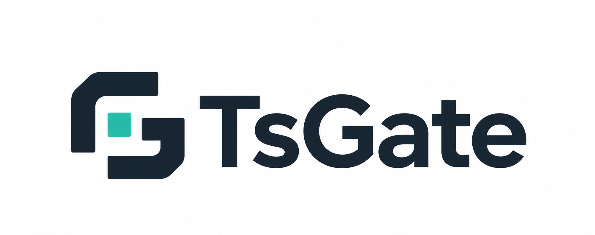
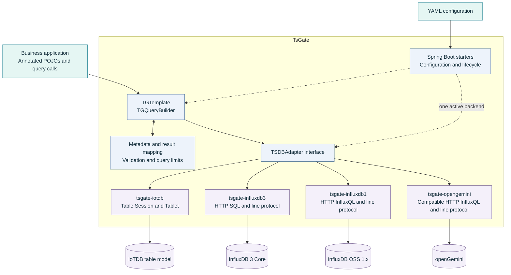

# TsGate

[English](README.md) | [简体中文](README.zh-CN.md)

TsGate is a modular Java adapter library for time-series databases. It brings annotated POJO writes, fluent queries and result mapping behind a shared API, with dedicated adapters for **IoTDB's table model**, **InfluxDB 3 Core**, **InfluxDB OSS 1.x** and **openGemini**.

Applications can integrate an adapter directly or use its Spring Boot starter. Enable the selected starter with `enable: true` and supply its connection settings. Other backends stay inactive by default. TsGate keeps database-specific capabilities explicit while reducing repeated connection, mapping and query code.

## What TsGate provides

- Annotated POJO mapping with `@TGMeasurement`, `@TGTime`, `@TGTag` and `@TGField`.
- Synchronous single and batch writes with explicit batch commit outcomes.
- Fluent filtering, projections, aggregation and pagination, subject to backend capabilities.
- Validated result conversion, bounded queries and consistent exception codes.
- Independent Spring Boot starters, YAML configuration and native or compatible client access.
- A Java 17 baseline and Apache-2.0 licensing.

## Architecture

`TGTemplate` and `TGQueryBuilder` provide the business-facing API. Shared metadata and mapping logic translate application objects into common records and query models. Implementations of `TSDBAdapter` translate those models into each database's protocol and query dialect.

The public annotations and query entry points use the `TG` prefix: `TGMeasurement`, `TGTime`, `TGTag`, `TGField`, `TGTemplate` and `TGQueryBuilder`. The default Spring template bean is named `tgTemplate`.

All four backends are disabled by default. Configure the chosen backend directly in `application.yml` and explicitly set its `enable` flag to `true`. No `spring.profiles.active` option or `enable: false` entries for other backends are required. Missing or false flags keep a backend inactive even when connection settings are present.

**One Spring context enables at most one backend**; multiple active backends fail before client initialization, and no explicitly enabled backend means no adapter, `TGTemplate` or official client bean is created. Active backends still undergo complete configuration validation. The four adapter branches above represent available implementations; native or compatible clients are exposed for backend-specific operations.

### Modules

| Module | Responsibility |
|---|---|
| `tsgate-bom` | Consumer dependency versions; no Spring Boot or test framework baseline |
| `tsgate-core` | Shared annotations, metadata, models, query builder and template |
| `tsgate-iotdb` | IoTDB table-model adapter |
| `tsgate-influxdb3` | InfluxDB 3 Core adapter |
| `tsgate-influxdb1` | InfluxDB OSS 1.x / InfluxQL adapter |
| `tsgate-iotdb-spring-boot-starter` | IoTDB auto-configuration |
| `tsgate-influxdb3-spring-boot-starter` | InfluxDB 3 auto-configuration |
| `tsgate-influxdb1-spring-boot-starter` | InfluxDB 1.x auto-configuration |
| `tsgate-opengemini` | openGemini default-engine / InfluxQL adapter |
| `tsgate-opengemini-spring-boot-starter` | openGemini auto-configuration |

## Compatibility

| Component | Baseline or verified versions |
|---|---|
| Java | Java 17 minimum; tested JDK 17 / 21 / 25 combinations |
| Spring Boot | Tested 2.7.18 / 3.5.14 / 4.1.0 combinations |
| IoTDB Java client | Default 2.0.11; overrides use build dependency management and require compatibility validation |
| IoTDB table model | 2.0.2 with Tablet RPC encoding disabled; 2.0.10 and 2.0.11 |
| InfluxDB 3 Core | 3.0.0 / 3.0.3 with `strict-cursor-sql: union-all`; 3.10.0 / 3.11.5 |
| InfluxDB OSS 1.x | 1.13.1 |
| openGemini default engine | 1.4.1 / 1.5.2; single node and three-node/three-replica cluster |

These are verified versions, not a guarantee covering every release or version combination. Backend capabilities differ; the bilingual Wiki guides record the exact matrix and limitations.

Tablet RPC encoding/compression is enabled by default. For older IoTDB servers without this protocol capability, explicitly set `tsdb.iotdb.table.rpc-compression-enabled: false`; SDK versions are selected through build dependencies, independently of YAML connection settings.

InfluxDB 3 strict composite cursor pagination defaults to `tsdb.influxdb.strict-cursor-sql: or`. An explicit `union-all` strategy accommodates older query planners while preserving complete ordering and query limits. It may increase server-side scanning; the bilingual Wiki guides explain its scope and verified combinations.

Maven artifacts use the GitHub-identity groupId `io.github.alandevise` and Java packages use `com.alandevise.tsgate.*`. Strict cursors preserve backend column identity and reject invalid time boundaries. All adapters have idempotent initialization and terminal closure; IoTDB applications must create a new instance after close. The bilingual Wiki documents cursor keys, supported Map result types and lifecycle rules.

TsGate 2.1.0 moves Java packages from `com.alandevise.tsdb.*` to `com.alandevise.tsgate.*`. Update imports, reflection names and package-scanning settings, then recompile applications and dependent libraries. This package change is not binary compatible. Maven coordinates, `tsdb.*` configuration prefixes, type names and the `tgTemplate` bean name stay the same. Central 2.0.0 retains the old packages. See [2.1.0 migration and release notes](https://github.com/AlanDevise/TsGate/wiki/EN-Release-Notes-2.1.0).

The optional `tsgate-bom` consolidates the verified client dependency versions into one explicit Maven import. It manages versions without adding unused clients to the application. InfluxDB 3 Arrow JVM options still belong to the application launcher; see the bilingual getting-started guides.

Version 2.1.0 also includes constructor-time configuration snapshots, strict cursor input validation, consistent structured-query argument errors, and startup failure handling with optional native clients. Configuration changes require a new adapter/context. The bilingual Wiki records migration steps and exact verification scope; [release status](https://github.com/AlanDevise/TsGate/wiki/EN-Testing-and-Publishing#tsgate-210-release-status) is tracked separately from test results.

Version 2.1.0 adds openGemini adapters and starters for **1.4.1 / 1.5.2 default-engine** deployments, verified as single nodes and three-node/three-replica clusters. Applications use the existing `TGTemplate`, annotations and fluent queries with the `tsdb.opengemini` prefix and a reachable SQL endpoint. The adapter reuses the bounded InfluxDB 1.x-compatible HTTP implementation; strict composite cursors, FIELD sorting, regional calendar-day windows and COLUMNSTORE/Arrow are outside its supported scope. Its borrowed compatible native client is `org.influxdb.InfluxDB`. Integer preflight prevents known float64 rounding on this HTTP path; new-series indexes become query-visible asynchronously after acknowledgement. See the [OpenGemini guide](https://github.com/AlanDevise/TsGate/wiki/EN-OpenGemini) for the exact boundaries. Central 2.0.0 does not contain these new modules.

## Documentation

TsGate's English and Chinese guides are available on the [GitHub Wiki](https://github.com/AlanDevise/TsGate/wiki). They cover getting started, connection configuration, annotated data models, fluent queries, pagination, backend compatibility, testing and upgrades.

[English guide](https://github.com/AlanDevise/TsGate/wiki/EN-Overview) · [简体中文指南](https://github.com/AlanDevise/TsGate/wiki/ZH-Overview)

The [TsGate skill](SKILL.md) guides coding assistants through application integration and contributor maintenance, including API examples, module responsibilities, compatibility boundaries, tests and documentation updates. To use it, install this file in a `tsgate` skill directory recognized by your assistant, or explicitly ask the assistant to read it. Root-file discovery depends on the tool.

Refer to each module's Javadoc for API contracts, configuration options, resource lifecycle and backend-specific limits.

## License

TsGate is licensed under the [Apache License 2.0](LICENSE). Copyright attribution is retained in [NOTICE](NOTICE); third-party dependencies retain their respective licenses.
