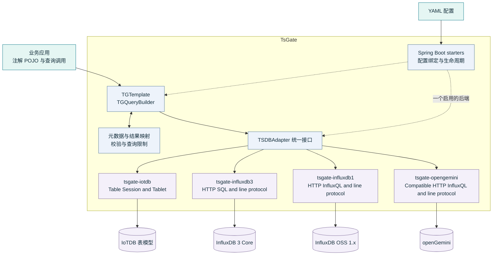

# TsGate

<p align="center"></p>


[](LICENSE)

[English](README.md) | [简体中文](README.zh-CN.md)

TsGate 是一个模块化的 Java 时序数据库适配组件。它以统一 API 提供注解 POJO 写入、链式查询和结果映射，支持 **IoTDB 表模型**、**InfluxDB 3 Core**、**InfluxDB OSS 1.x** 和 **openGemini** 多种后端。

业务应用可以直接接入 adapter，也可以使用对应的 Spring Boot starter。配置所需后端的 `enable: true` 和连接信息即可，其他后端默认关闭。TsGate 减少重复的连接、映射与查询代码，同时明确保留不同数据库的能力差异。

## 核心能力

- 通过 `@TGMeasurement`、`@TGTime`、`@TGTag`、`@TGField` 映射业务 POJO。
- 同步单条与批量写入，明确表达批次提交结果。
- 按后端能力提供链式过滤、字段选择、聚合和分页。
- 查询结果转换校验、查询资源限制与统一异常错误码。
- 独立 Spring Boot starter、YAML 配置和原生或兼容客户端访问。
- Java 17 运行基线与 Apache-2.0 许可证。

## Maven 依赖

Spring Boot 应用在 `pom.xml` 的 `<dependencies>` 中加入所选依赖即可。每个 starter 已包含对应 adapter 和公共 core。

### InfluxDB 1.x

```xml
<dependency>
    <groupId>io.github.alandevise</groupId>
    <artifactId>tsgate-influxdb1-spring-boot-starter</artifactId>
    <version>2.1.0</version>
</dependency>
```

### IoTDB

```xml
<dependency>
    <groupId>io.github.alandevise</groupId>
    <artifactId>tsgate-iotdb-spring-boot-starter</artifactId>
    <version>2.1.0</version>
</dependency>
```

在 `application.yml` 中将所选后端的 `tsdb.influxdb1.enable` 或 `tsdb.iotdb.enable` 设为 `true`，并填写连接参数。详见 [配置示例](https://github.com/AlanDevise/TsGate/wiki/ZH-Configuration)。

## 架构设计



`TGTemplate` 与 `TGQueryBuilder` 提供面向业务的统一 API。共享的元数据解析和映射逻辑将业务对象转换为统一记录与查询模型，再由 `TSDBAdapter` 的实现转换为各数据库的协议和查询方言。

公共注解和查询入口统一采用 `TG` 前缀：`TGMeasurement`、`TGTime`、`TGTag`、`TGField`、`TGTemplate` 和 `TGQueryBuilder`。Spring 默认模板 Bean 名称为 `tgTemplate`。

四个后端默认关闭。业务直接在 `application.yml` 中填写连接参数，并将所需后端的 `enable` 显式设为 `true`；无需配置 `spring.profiles.active`，也无需为其他后端填写 `enable: false`。省略 `enable` 或设置为 `false` 均不启用，即使保留了连接参数。

**一个 Spring 上下文最多启用一个后端**；同时启用多个后端会在客户端初始化前报错，没有显式启用的后端时不创建 adapter、`TGTemplate` 或官方客户端 Bean。启用的后端仍执行完整配置校验。图中的四个适配分支表示可选实现；组件暴露原生或兼容客户端，供业务使用后端专有能力。

### 模块组成

| 模块 | 职责 |
|---|---|
| `tsgate-bom` | 业务侧依赖版本管理，不引入 Spring Boot 或测试框架基线 |
| `tsgate-core` | 公共注解、元数据、模型、查询构造器与模板 |
| `tsgate-iotdb` | IoTDB 表模型适配 |
| `tsgate-influxdb3` | InfluxDB 3 Core 适配 |
| `tsgate-influxdb1` | InfluxDB OSS 1.x / InfluxQL 适配 |
| `tsgate-iotdb-spring-boot-starter` | IoTDB 自动装配 |
| `tsgate-influxdb3-spring-boot-starter` | InfluxDB 3 自动装配 |
| `tsgate-influxdb1-spring-boot-starter` | InfluxDB 1.x 自动装配 |
| `tsgate-opengemini` | openGemini 默认引擎 / InfluxQL 适配 |
| `tsgate-opengemini-spring-boot-starter` | openGemini 自动装配 |

## 兼容范围

| 组件 | 基线或已验证版本 |
|---|---|
| Java | 最低 Java 17；验证过 JDK 17 / 21 / 25 的指定组合 |
| Spring Boot | 验证过 2.7.18 / 3.5.14 / 4.1.0 的指定组合 |
| IoTDB Java 客户端 | 默认 2.0.11；通过构建依赖管理覆盖版本，并验证所选组合的兼容性 |
| IoTDB 表模型 | 2.0.2（须关闭 Tablet RPC 编码压缩）、2.0.10、2.0.11 |
| InfluxDB 3 Core | 3.0.0 / 3.0.3（须配置 `strict-cursor-sql: union-all`）、3.10.0 / 3.11.5 |
| InfluxDB OSS 1.x | 1.13.1 |
| openGemini 默认引擎 | 1.4.1 / 1.5.2；单节点与三节点三副本集群 |

这些是已经验证的版本，不表示所有版本及其组合均兼容。各后端能力存在差异，中英文 Wiki 文档保留完整测试矩阵和限制。

Tablet RPC 编码压缩默认开启。连接不具备该协议能力的旧版 IoTDB 时，应显式设置 `tsdb.iotdb.table.rpc-compression-enabled: false`；SDK 版本通过构建依赖选择，与 YAML 连接参数分别配置。

InfluxDB 3 严格复合游标分页默认使用 `tsdb.influxdb.strict-cursor-sql: or`。业务可显式选择 `union-all`，以兼容旧版查询规划器，并保留完整排序与查询限制。该策略可能增加服务端扫描开销，具体适用范围和已验证组合见中英文 Wiki 使用说明。

Maven 制品采用 GitHub 身份对应的 groupId `io.github.alandevise`，Java 包为 `com.alandevise.tsgate.*`。严格游标按后端物理列身份处理并拒绝非法时间边界；四个后端均采用幂等初始化与终态关闭，IoTDB 在关闭后需创建新实例。游标键、受支持的 Map 结果类型及生命周期规则详见中英文 Wiki。

详见 [2.1.0 发布说明](https://github.com/AlanDevise/TsGate/wiki/ZH-Release-Notes-2.1.0)。

可选的 `tsgate-bom` 将已验证的客户端依赖版本收敛为一次显式 Maven 导入；它只管理版本，不会让业务引入未使用的客户端。InfluxDB 3 的 Arrow JVM 参数仍需配置到业务启动进程，详见中英文入门指南。

2.1.0 还纳入构造时配置快照、严格游标输入校验、统一结构化查询参数错误，以及支持原生客户端可选注入的启动失败策略。修改配置需要新 adapter/上下文。中英文 Wiki 记录配置说明与准确验证范围；[发布状态](https://github.com/AlanDevise/TsGate/wiki/ZH-Testing-and-Publishing#tsgate-210-发布状态)与测试结果分别记录。

2.1.0 新增 openGemini adapter 与 starter，支持 **1.4.1 / 1.5.2 默认引擎**，已验证单节点和三节点三副本集群。业务沿用 `TGTemplate`、注解和链式查询，使用 `tsdb.opengemini` 前缀与可达的 SQL 入口。实现复用有界的 InfluxDB 1.x 兼容 HTTP 协议；严格复合游标、FIELD 排序、区域日历日窗口及 COLUMNSTORE/Arrow 不在支持范围内。借用的兼容原生客户端为 `org.influxdb.InfluxDB`。整数前检防止此 HTTP 路径已知的 float64 舍入；新 series 索引在写入确认后异步对查询可见。准确边界见 [OpenGemini 指南](https://github.com/AlanDevise/TsGate/wiki/ZH-OpenGemini)。Central 2.0.0 不包含这两个新模块。

## 项目文档

TsGate 的中英文使用指南位于 [GitHub Wiki](https://github.com/AlanDevise/TsGate/wiki)，涵盖快速开始、连接配置、注解数据模型、链式查询、分页、后端兼容性、测试和升级说明。

[English guide](https://github.com/AlanDevise/TsGate/wiki/EN-Overview) · [简体中文指南](https://github.com/AlanDevise/TsGate/wiki/ZH-Overview)

[TsGate 技能](SKILL.md) 为编码助手提供业务接入与贡献开发两条工作流，涵盖 API 示例、模块职责、兼容边界、测试和文档同步。使用时，将该文件安装到所用助手识别的 `tsgate` 技能目录，或显式要求助手读取；能否自动发现根目录文件取决于具体工具。

各模块的 Javadoc 提供 API 契约、配置选项、资源生命周期及后端特有限制的说明。

## 许可证

TsGate 采用 [Apache License 2.0](LICENSE)，版权归属见 [NOTICE](NOTICE)；第三方依赖遵循各自许可证。
